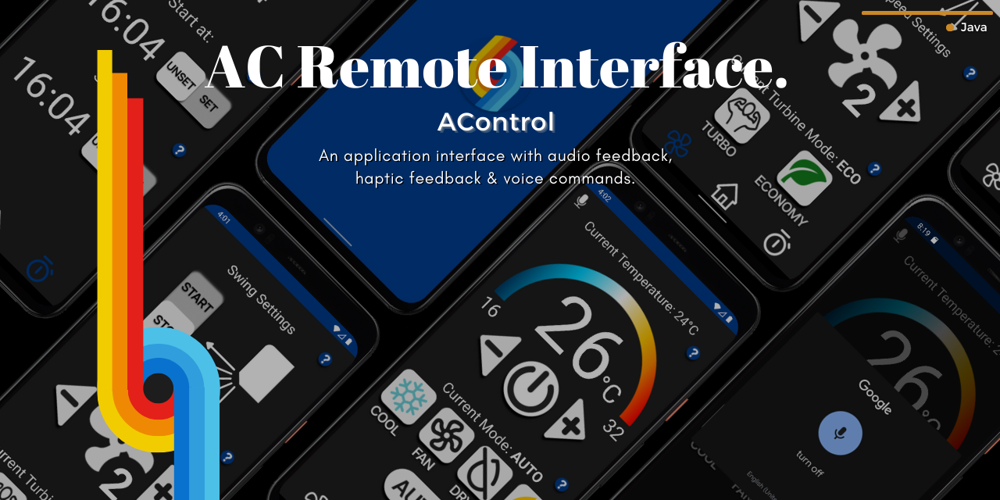

# AControl
**AC**ontrol is an AC remote control interface made for our Human-Computer Interaction course @AUEB. 

The app's functions are based on those of any existing AC device. Our goal was to simplify and improve user experience as well as provide accessibility options that were previously non-existent. The final application offers voice command control, haptic and audio feedback. During the implementation we followed the Spiral development method, a full report including the stages of each cycle and the evaluation methods used can be found [here](./report.pdf). 

# Available Screens & Functions
The app contains 3 activity screens:
- Main Screen
- Advanced Features Screen
- Timer Screen

## Main Screen
The main screen is the launcher screen of the application since it contains the most important interface options. Voice control can also be used in the main screen's featured functions. Each of these functions offers a variety of visual, audio or haptic feedback to make sure the user is aware of the device's state at all times.

### ON/OFF
The interface has a power button meant for powering the AC on and off.

### Temperature Control
The target temperature can be set through the temperature control menu.

### Mode Selection
The user can pick one of 5 operation modes. Those are the following:
- Auto
- Cool
- Heat
- Dry
- Vent (Fan)

## Advanced Features Screen
This screen can be navigated through the nav-bar by clicking the fan icon, indicative of its most crucial feature which is fan speed control. The entirety of its features include:

### Swing Control
Offers the user the option to start and stop the swing operation of the device.

### Fan Speed Control
The user can choose their desired fan speed.

### Turbine Mode Selection
The user can pick one of 2 turbine modes. Those are the following:
- Economy
- Turbo

## Timer Screen
As the name indicates, this screen has a start and stop timer for the AC. Each timer changes the state of the AC's power button accordingly and sends a notification when said change takes place.

### Start Timer
Once the start timer is set a pending intent is created. At the selected time, the AC "turns on" and a notification is sent to the user informing them of the change. The timer is then automatically unset. If the timer is unset before the event of the selected time, the pending intent gets destroyed. 

### Stop Timer
Once the stop timer is set a pending intent is created. At the selected time, the AC "turns off" and a notification is sent to the user informing them of the change. The timer is then automatically unset. If the timer is unset before the event of the selected time, the pending intent gets destroyed. 

# Tools Used
The elements of the app were all created from scratch in Figma, an online mockup and vector graphics tool. Two versions were created for each button, a pressed state and an unpressed state. Through this difference in appearance we hoped to achieve additional visual feedback to the user since the selected mode/state is always visible through each button's look.

The app and the entirety of its functionality was implemented in Android Studio using Java.

